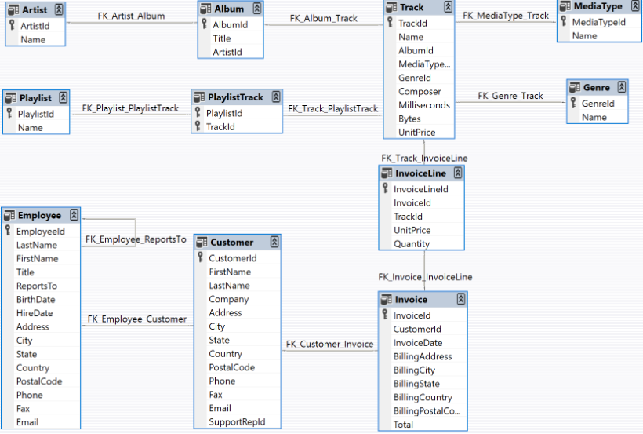

# 🎵 Chinook Database SQL Analysis

## 📌 Project Overview
This project explores the **Chinook sample database**, which represents a digital music store.  
Using **SQLite** and **SQL queries**, I analyzed sales, revenue, and customer behavior to extract meaningful business insights.

The analysis answers questions such as:
- Which tracks are the **best-sellers**?
- Which artists and albums generate the most **revenue**?
- Which **genres** perform the best?
- Which **countries, states, and cities** contribute most to revenue?
- How does **monthly performance** look over time?
- Which tracks are the **top revenue earners each month** (using window functions)?

---

## 📸 Sample Output

### Example 1: Top-Selling Tracks  


### Example 2: Revenue by Country  


---

## 📂 Project Structure
📁 Chinook-SQL-Analysis/
├── Chinook_Sqlites.sqlite # Database file
├── Chinook_Project.sqbpro # DB Browser for SQLite project file (queries saved here)
├── Pic/ # Screenshots of results
│ ├── screenshot_1.png
│ └── screenshot_2.png
└── README.md # Documentation


---

Data Model
The Chinook data model represents a digital media store, including tables for artists, albums, media tracks, invoices and customers.




## 🛠️ Tools & Technologies
- **Database:** SQLite (DB Browser for SQLite)  
- **Language:** SQL

---

## 🔍 Queries Implemented

### Query 1: Top 10 Best-Selling Tracks by Quantity
Finds the tracks with the highest number of units sold.

### Query 2: Top 10 Revenue-Generating Tracks
Identifies tracks generating the most revenue, with album and artist details.

### Query 3: Top-Selling Products by Genre
Aggregates sales by genre to reveal which genres dominate revenue.

### Query 4: Revenue by Country
Breaks down revenue and order values by country.

### Query 5: Revenue by State/Province
Analyzes regional performance for countries with detailed state/province data.

### Query 6: Top Cities by Revenue
Highlights the top 15 revenue-generating cities worldwide.

### Query 7: Monthly Performance by Track
Shows monthly sales and revenue for each track with artist and album context.

### Query 8: Join Products and Sales
Demonstrates joining product (Track) and sales (InvoiceLine) tables.

### Bonus Query: Rank Tracks by Monthly Revenue (Window Function)
Uses `ROW_NUMBER()` to identify the top revenue track in each month.

---

## 📊 Key Insights
- **Top-selling tracks ≠ top revenue tracks** (pricing plays a role).  
- **Rock and Metal** dominate in both sales and revenue.  
- **USA, Canada, and European countries** contribute the most to revenue.  
- Revenue is concentrated in **specific cities** (e.g., Prague, Paris, London).  
- **Monthly breakdown** shows clear peaks and seasonal sales.  
- Window functions help identify the **#1 track per month** effectively.  

---

## 🚀 How to Run
1. Clone this repository:
   ```bash
   git clone https://github.com/yourusername/chinook-sql-analysis.git
   cd chinook-sql-analysis

## 📬 Author  
**Ashar Aftab**  
📧 Email: [asharaftab2004@gmail.com](mailto:asharaftab2004@gmail.com)  
🔗 LinkedIn: www.linkedin.com/in/ashar-aftab-b09924295

---

## 📜 License  
This project is free for educational and non-commercial use.  
Feel free to fork, improve, and give credit where due.

---

> If you found this project useful or insightful, consider giving it a ⭐ on GitHub!

